Čo je Operačný System?
---

<!-- speaker_note: Spomen ine OS-y, ako iOS, Android -->
<!-- new_lines: 5 -->
<!-- column_layout: [2, 2, 2, 1] -->

<!-- column: 0 -->

<!-- new_lines: 2 -->
<!-- alignment: center -->
<!-- font_size: 2 -->
**Windows 11**
<!-- font_size: 1 -->
<!-- alignment: left -->


<!-- column: 1 -->

<!-- new_lines: 2 -->
<!-- alignment: center -->
<!-- font_size: 2 -->
**MacOS**
<!-- font_size: 1 -->
<!-- alignment: left -->


<!-- column: 2 -->

<!-- new_lines: 2 -->
<!-- alignment: center -->
<!-- font_size: 2 -->
**Linux**
<!-- font_size: 1 -->
<!-- alignment: left -->


<!-- column: 3 -->
<!-- jump_to_middle -->
_(etc...)_

<!-- reset_layout -->
<!-- pause -->

---
Operačný systém je základný softvér, ktorý riadi počítačový hardvér a poskytuje služby pre ostatné programy.

Je to most medzi používateľom (a jeho programami) a komponentmi počítača (CPU, pamäť, úložisko, atď.).

<!-- end_slide -->

Počiatky: UNIX
---

<!--
speaker_note: |
    Nazov UNIX je slovná hračka z predošlého projektu zvaného MULTICS

    MULTICS (Multiplexed Information and Computer Services) bol multitaskingový operačný systém, ale UNIX bol singletaskingový, preto Multiplexed -> Uniplexed


    PDP-11 bol jeden z prvych pocitacov, ktore vedeli bezat UNIX. Pisalo sa na dalekopis (teleprinter, klavesnica + tlaciaren)
    PDP-11 bol uvedeny na trh v roku 1970


    Ken Thompson (nalavo), Dennis Ritchie (napravo)
    Praca na UNIX-e zacala v 1969, prvykrat vyhlaseny mimo Bell Labs v 1973
    Unix bol napisany v C a assembly, a vacsina kodu bola sukromna (closed-source), ale su volnejsie verzie (napr. BSD)
    Bell Labs je výskumná a vývojová spoločnosť, byvala dcerska spolocnost AT&T, jej vyskumnici su pripisovani vyvoju transistora, laser-u, fotovoltaickeho clanku, B, C, C++, AWK, Unix
-->

<!-- column_layout: [1, 1, 1] -->

<!-- column: 0 -->

# UNIX Verzia 7 pre PDP-11

<!-- column: 1 -->

# Dennis Ritchie & Ken Thompson s počítačom PDP-11/20

<!-- column: 2 -->

# Ken Thompson & Dennis Ritchie @ Bell Labs 1973

<!-- reset_layout -->
<!-- pause -->

---
UNIX bol jeden z prvých vplyvných operačných systémov, vytvorený v Bell Labs koncom 60. rokov 20. storočia.

Bol navrhnutý ako viacužívateľský a multitaskingový, a jeho návrhové princípy boli veľmi dôležité.

Známy pre svoje rozhranie príkazového riadka a výkonné nástroje.

UNIX bol **uzavretý** a **veľmi** drahý softvér.
Cena _US$20,000_ licencovaná vzdelávacím inštitúciám a komerčným užívateľom.

<!-- end_slide -->

Free Software Foundation (FSF): GNU a RMS
---

<!-- column_layout: [1, 1, 1] -->

<!-- column: 0 -->

# Richard Matthew Stallman

<!-- column: 1 -->

# Free Software Foundation

<!-- column: 2 -->

# GNU (GNU's Not Unix!)

<!-- reset_layout -->
<!-- pause -->

---
<!-- column_layout: [1, 1] -->

<!-- column: 0 -->
## Richard Matthew Stallman (RMS)
- 1983: založil projekt **GNU** s cieľom vytvoriť _kompletne slobodný_ operačný systém.
- 1985: založil **FSF**, neziskovú organizáciu, ktorá vyvíjala projekt _GNU_ a známe licencie ako _GNU General Public License (GPL)_.

## GNU
Manifesto:
> 1. Sloboda spúšťať softvér na akýkoľvek účel.
> 2. Sloboda študovať mechaniku programu a upravovať ho.
> 3. Sloboda šíriť kópie.
> 4. Sloboda vylepšovať a meniť upravené verzie pre verejné použitie.

<!-- column: 1 -->
Projekt obsahoval:
  - Shell (bash)
  - Coreutils (cat, ls, rm...)
  - GNU Compiler Collection (GCC)
  - Mnoho ďalších programov a knižníc

## Kernel (jadro)
Do roku 1992 projekt GNU dokončil všetky hlavné nástroje operačneho systému, ale _nedokočil_ navrhované jadro GNU Hurd.


<!-- end_slide -->

Prichadza Linus Torvalds: Zrodenie Linuxu
---

<!-- column_layout: [1, 1, 1] -->

<!-- column: 0 -->

# Linus Torvalds, vynálezca Linuxu a Gitu

<!-- column: 1 -->

# Tux, logo Linuxu

<!-- column: 2 -->
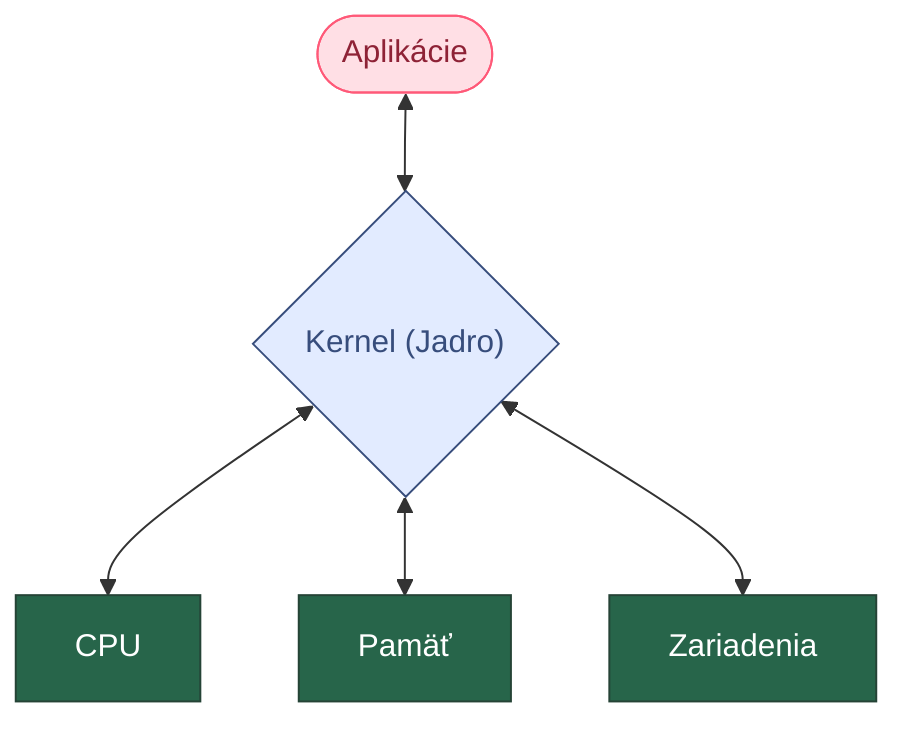
# Čo je kernel (jadro)?

<!-- reset_layout -->
<!-- pause -->

---

<!-- column_layout: [1, 1] -->

<!-- column: 0 -->
## Linus Torvalds
- fínsky programátor, začal vývoj Linuxu, dodnes je správcom hlavnej vetvy vývoja.
- Študoval koncepty operačných systémov na Helsinskej Technickej Univerzite.
- V škole používal Minix, potreboval schopný UNIXový OS, ktorý by mohol prevádzkovať na jeho domácom PC.
<!-- speaker_note: |
    Minix:
      - UNIX-like OS
      - založený na mikrojadrovej architektúre
      - určený na vzdelávacie účely
      - mini-Unix
      - stále uzavretý
      - Mikrojadrová architektúra:
          - minimalistické jadro, poskytuje len základné služby OS (syscalls)
          - iné služby poskytujú user-space servery (napr. na podporu internetovej sieti)
-->

## Riešenie: Linux
- 1991: Pokorne oznámil, že pracuje na Linuxe od marca
- Založený na monolitickej architektúre
- Licencia: GNU General Public License (GPLv2)
<!-- speaker_note: |

    Linux:
      - Monolitická architektúra
        - Všetok kód beží v rovnakom jadrovom pamäťovom priestore (kernel space)
-->

<!-- column: 1 -->


<!-- end_slide -->

Spolupraca: GNU + Linux
---

Linusovo jadro (Linux) bolo chýbajúcim kúskom pre Projekt GNU.

Vývojári skombinovali jadro Linuxu s nástrojmi GNU a vytvorili kompletný, slobodný operačný systém.

Toto sa často označuje ako GNU/Linux.

<!-- pause -->

---


<!-- alignment: center -->
# GNU + Linux Copypasta RMS
<!-- alignment: left -->
<!-- speaker_note: |
    Copypasta:
      - citat od RMS
      - tvrdi, ze nevyslovil vsetko co je v citate, len velku vacsinu
      - smiesne lebo pedanticky clovek, socialne trapny moment
-->

<!-- end_slide -->

Zakladna Sada Nastrojov: GNU Coreutils
---

Toto sú základné programy príkazového riadka, ktoré nájdete na takmer každom systéme Linux.

### ls
Zobrazenie obsahu priečinku
```bash +exec
ls
```

<!-- pause -->

### mkdir, cd
Vytvorenie nového priečinku.

Zmena aktuálneho priečinku.
```bash +exec
mkdir Dokumenty
ls
cd Dokumenty
```

<!-- end_slide -->

Nie iba Linux a Unix, ale mnoho ďalšich
---

<!-- new_lines: 6 -->

<!-- column_layout: [1, 4, 1] -->

<!-- column: 0 -->

<!-- alignment: center -->
# BSD
<!-- alignment: left -->

<!-- new_line -->


<!-- alignment: center -->
# Minix
<!-- alignment: left -->

<!-- column: 1 -->
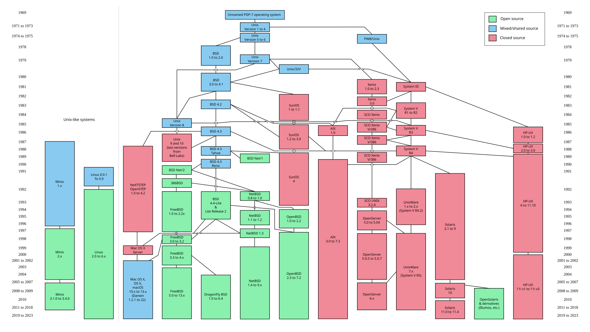

<!-- column: 2 -->
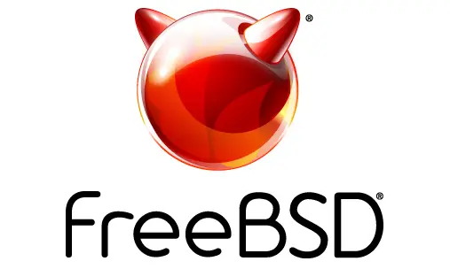
<!-- alignment: center -->
# FreeBSD
<!-- alignment: left -->

<!-- new_lines: 5 -->

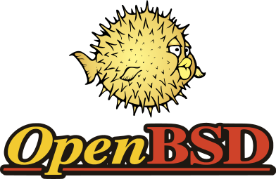
<!-- alignment: center -->
# OpenBSD
<!-- alignment: left -->

<!-- new_lines: 5 -->
<!-- reset_layout -->

<!-- speaker_note: |
    BSD:
      - Berkeley Software Distribution
      - od University of California Berkeley
      - 1978, bol propagovany ako zlepsena verzia AT&T Unixu
      - monolitická architektúra

    FreeBSD:
      - vysiel 1993, stale sa na nom pracuje a pouziva sa
      - jeden z prvych open source unix-like operačných systémov
      - najpouzivanejsi OS odvodeny od BSD
      - monolitická architektúra
      - obsahuje jadro, ovladace zariadeni (device drivers), userland utilities (as opposed to Linux and GNU)

    OpenBSD:
      - vysiel 1995, by forking NetBSD 1.0
      - monolitická architektúra
      - sustredeny na bezpecnost, portability, standardizáciu a kryptografiu

    macOS:
      - based on Darwin which is based on BSD
-->

<!-- end_slide -->

Voľba, Voľba Voľba: Linux Distribucie
---

<!-- column_layout: [1, 1, 1] -->

<!-- column: 0 -->
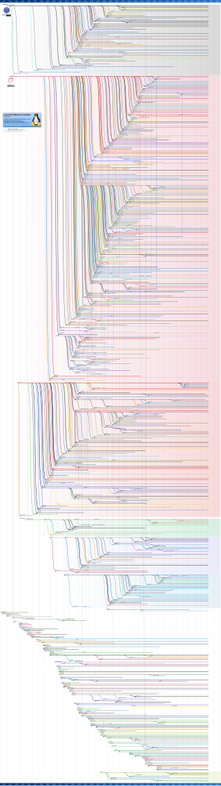

<!-- column: 1 -->
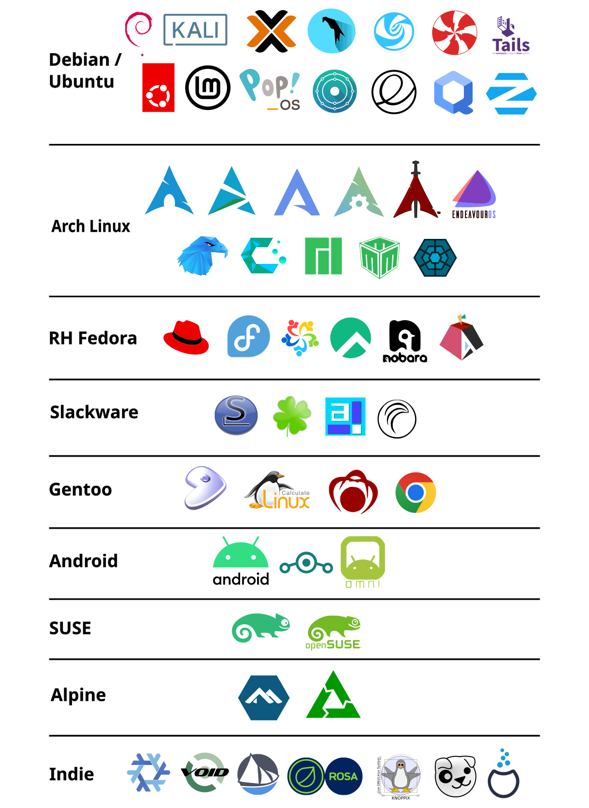

---

## Čo je Linux distribúcia?
Je to ucelený operačný systém zložený z častí:
- kernel (Linux)
- libs (glibc, libstdc++, libX11...)
- init-system (systemd, sysvinit, OpenRC...)
- package manažér (pacman, apt, dnf...)

Rôzne distribúcie balia softvér odlišne a majú rôzne ciele (jednoduchosť použitia, stabilita, špecifické použitia).

<!-- speaker_note: |
  Je velmi vela distribucii, dolezite je si 1 vybrat a proste to pouzivat, ked potom nepaci, da sa velmi lahko vymenit, ale 90% je rovnake.

  Linux history tree:
    - Ukazuje kedy ktora distribucia bola vytvorena z ktorej

  glibc - GNU C Library
        - core system functions
  libstdc++ - Standard C++ Library
  libX11 - X11 libraries

  distrowatch.com - rozsiahle info o distribúciach linuxu
-->

<!-- column: 2 -->
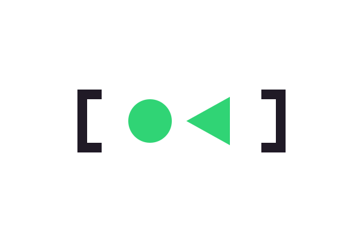
<!-- alignment: center -->
# systemd
<!-- alignment: left -->

<!-- new_lines: 2 -->

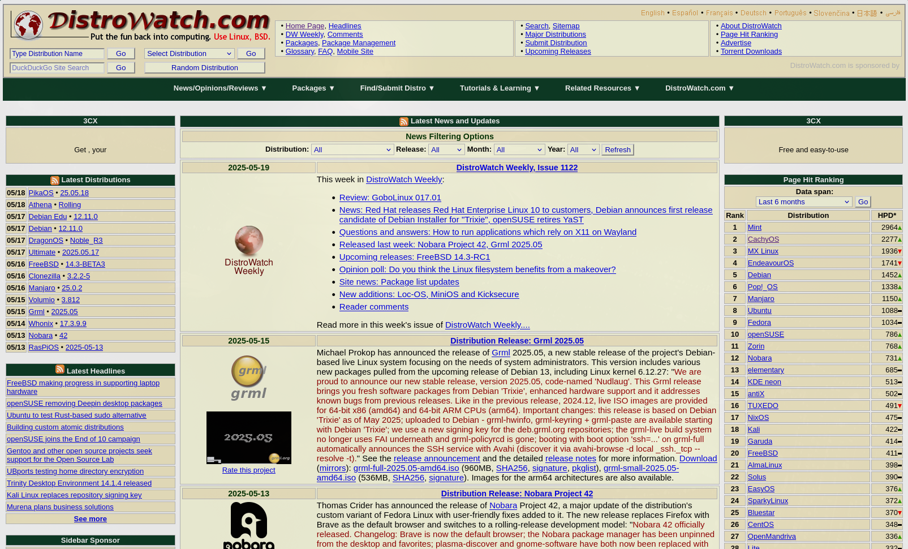
<!-- alignment: center -->
# distrowatch.com
<!-- alignment: left -->

<!-- new_lines: 2 -->
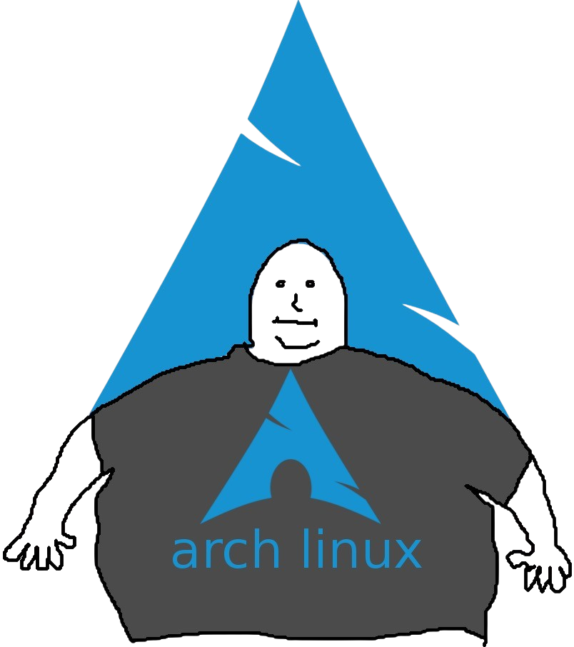

<!-- end_slide -->

Ziskavanie Softveru: Package Managers
---
Správca balíkov (package manager) je systém, ktorý automatizuje proces inštalácie, aktualizácie, konfigurácie a odstraňovania softvéru.

Zabezpečuje závislosti (keď jeden program potrebuje iný, aby fungoval).

Zjednodušuje inštaláciu softvéru na Linuxe v porovnaní s manuálnym sťahovaním a inštaláciou.

<!-- column_layout: [1, 1, 1] -->

<!-- column: 0 -->
## Príklady:
- `apt`, `pacman` - tradicionálne sysytem-level package managery
- `rpm`, `yum`, `dnf`, `zypper` - rpm-based package managery
- `snap`, `flatpak`, - univerzálne kontajnerizované balíky
- `emerge` - založený na manuálnej kompilácii zdroju balíkov

<!-- speaker_note: |
  apt - debian, debian-based
  pacman - arch, arch-based
  rpm - redhat, redhat-based, SUSE Linux Enterprise, openSUSE, backend (doesnt manage deps)
  yum - rpm++, manages deps
  dnf - fedora, yum++
  zypper - uses rpm backend, SUSE Linux Enterprise, openSUSE
  emerge - gentoo, source-based
-->

<!-- new_lines: 2 -->
## Nainštalovanie balíka:
```bash
sudo apt install firefox
sudo pacman -S firefox
sudo emerge www-client/firefox
sudo dnf install firefox
```

## Odinštalovanie balíka:
```bash
sudo apt remove firefox
sudo pacman -R firefox
sudo emerge --deselect www-client/firefox
sudo dnf remove firefox
```

<!-- column: 2 -->

## Repozitáre
- Centralizované online knižnice balíkov
- Package managery používajú tieto repozitáre na inštaláciu a aktualizáciu balíkov
- Existuje mnoho mirrorov repozitárov
- DebianStable, Arch official, AUR...

<!-- speaker_note: |

  DebianStable
    - 6 mesiacov dozadu
    - rigorous testing

  Arch official
    - rolling release
    - hlavne baliky, viac testingu

  AUR
    - Arch User Repository
    - baliky od Arch Linux community
    - hocikto vie nahrat balik => security risk
    - malo testingu, mozu byt baliky stare, nefungujuce
-->

<!-- new_lines: 4 -->
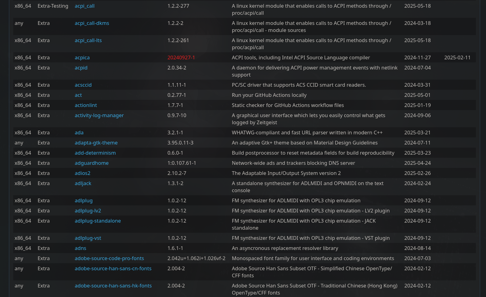
# AUR (Arch User Repository)

<!-- end_slide -->

Ako to Vidime: Window Managers (WM) & Desktop Environments (DE)
---

<!-- column_layout: [1, 1, 1] -->

<!-- column: 0 -->
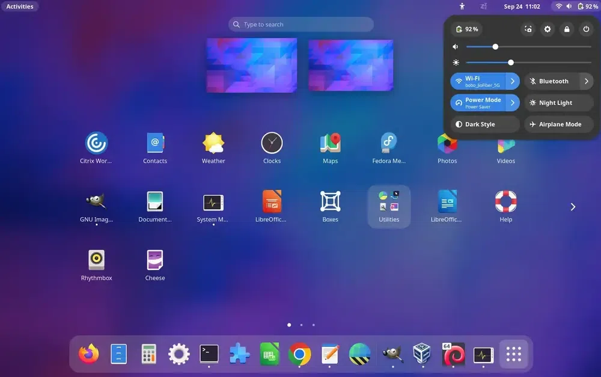
<!-- alignment: center -->
# GNOME (X11 + Wayland)
<!-- alignment: left -->

<!-- column: 1 -->

<!-- alignment: center -->
# KDE (X11 + Wayland)
<!-- alignment: left -->

<!-- column: 2 -->
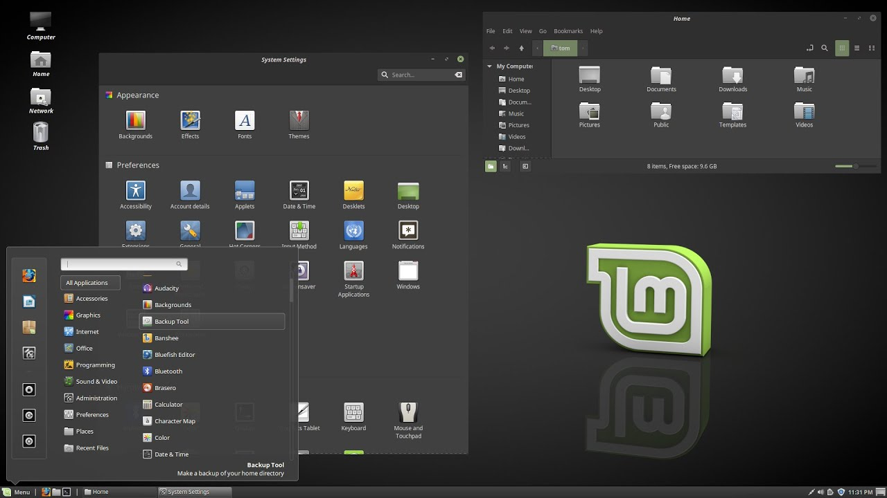
<!-- alignment: center -->
# Cinnamon (X11)
<!-- alignment: left -->

<!-- reset_layout -->

<!-- column_layout: [2, 1] -->

<!-- column: 0 -->
## Desktop Environments
- Kompletný GUI obsahujúci desktop, okná, ikony, panely, menu, file manager, terminal, nastavenia...

<!-- column: 1 -->
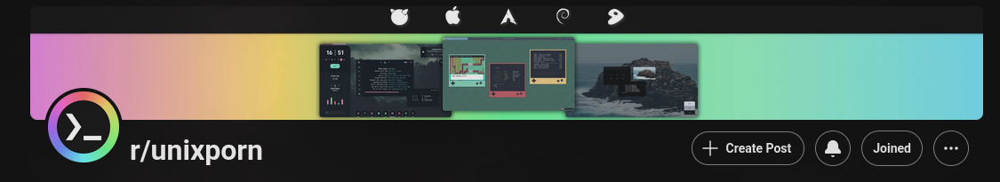

<!-- reset_layout -->
---

<!-- column_layout: [1, 1, 1] -->

<!-- column: 0 -->
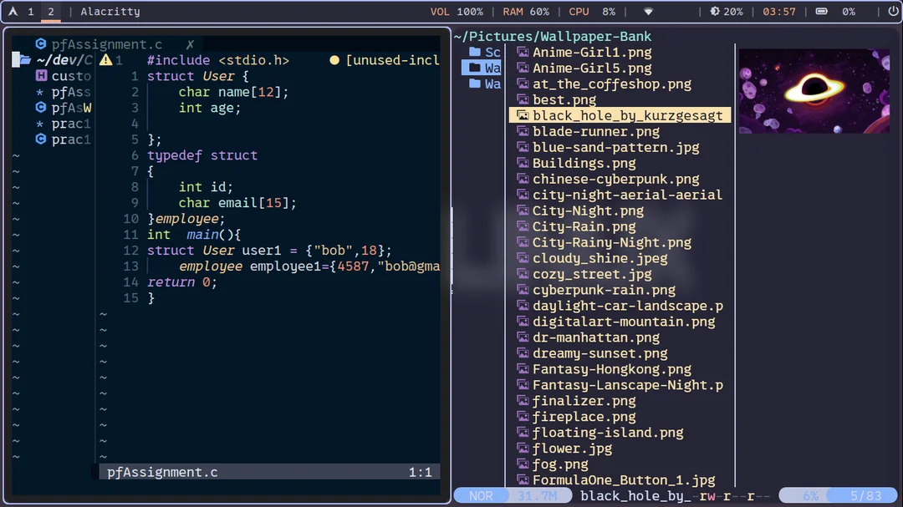
<!-- alignment: center -->
# i3 (X11)
<!-- alignment: left -->

<!-- column: 1 -->
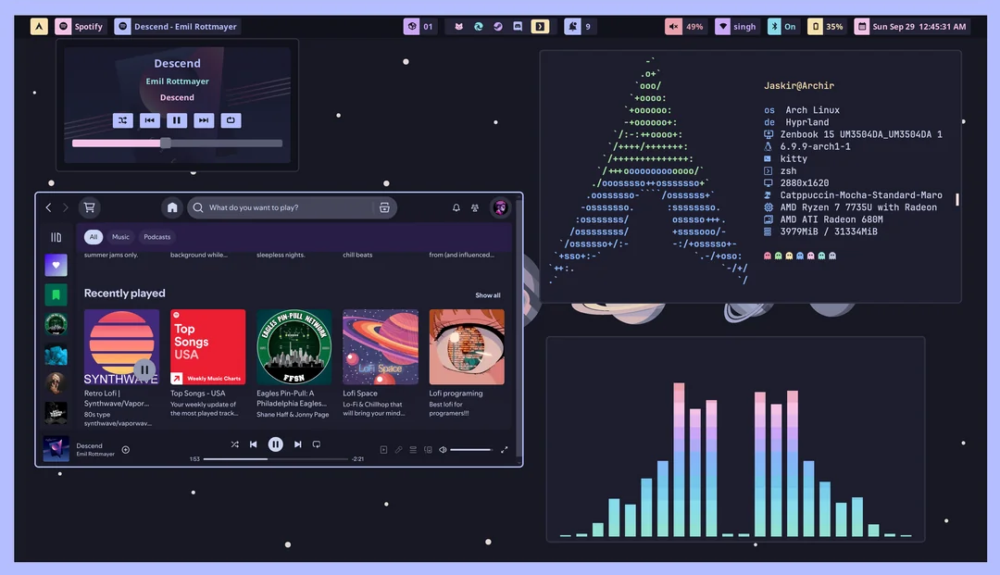
<!-- alignment: center -->
# Hyprland (Wayland)
<!-- alignment: left -->

<!-- column: 2 -->
## Window Managers
- Viac špecifické na kontrolovanie polohy a vzhľadu okien aplikácií
- Súčasťou DE

### Tiling window manager
- Trendy v modernej dobe
- Namiesto tradicionálneho floating principlu (okná sa voľne pohybujú) usporiada okná do samostatných "rámov", ktoré zapĺňajú celú obrazovku

<!-- speaker_note: |
  X Window System
    - koncept, protokol, ktory opisuje ako sa maju GUIs zobrazit na obrazovke
    - vysiel 1984
  X11
    - X verzia 11
    - vysla v 1987
    - najnovsia verzia X11R7.7 (release 7.7) 2012
    - problemy: screen tearing, komplexita v implementácii (client-server architektura)
  XORG
    - implementacia X11 servera, ktoru DE pouzivaju

  Wayland
    - koncept, protokol
    - vysiel 2008
    - novsi, jednoduchsi, lepsi vykon, viac bezpecny
-->

<!-- end_slide -->

Zaver: Prečo je Linux dôležitý?
---

Poháňa väčšinu svetových serverov a internetu.

Beží na superpočítačoch, smartfónoch (Android používa jadro Linuxu), embedded zariadeniach a desktopoch.

Je open source a riadený komunitou – podporuje spoluprácu a inovácie.

Poskytuje používateľom flexibilitu a kontrolu.

Linux je silným príkladom toho, ako spolupráca a filozofia slobodného softvéru môžu vytvoriť niečo, čo zmení svet.

Je to svedectvo príspevkov mnohých jednotlivcov a Projektu GNU.

---

<!-- new_lines: 5 -->
<!-- column_layout: [1, 1] -->

<!-- column: 0 -->
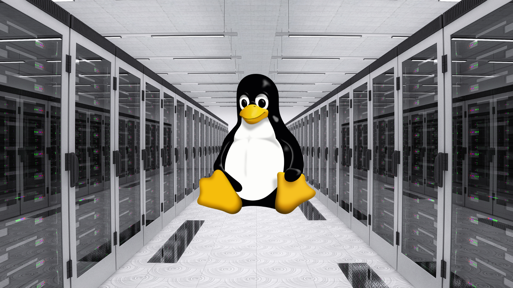

<!-- column: 1 -->
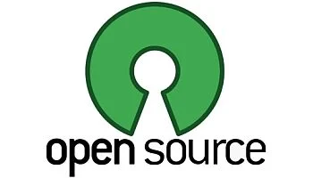

<!-- end_slide -->

<!-- jump_to_middle -->
<!-- column_layout: [1, 1, 1] -->
<!-- column: 1 -->
<!-- font_size: 5 -->
# **Otazky?**
