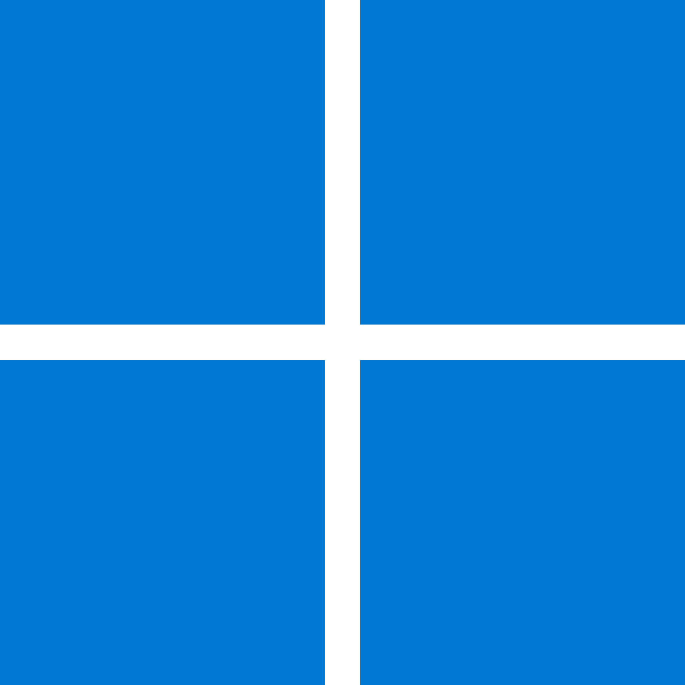

Čo je Operačný System?
---

<!-- speaker_note: Spomen ine OS-y, ako iOS, Android -->
<!-- new_lines: 5 -->
<!-- column_layout: [2, 2, 2, 1] -->

<!-- column: 0 -->

<!-- new_lines: 2 -->
<!-- alignment: center -->
<!-- font_size: 2 -->
**Windows 11**
<!-- font_size: 1 -->
<!-- alignment: left -->


<!-- column: 1 -->

<!-- new_lines: 2 -->
<!-- alignment: center -->
<!-- font_size: 2 -->
**MacOS**
<!-- font_size: 1 -->
<!-- alignment: left -->


<!-- column: 2 -->

<!-- new_lines: 2 -->
<!-- alignment: center -->
<!-- font_size: 2 -->
**Linux**
<!-- font_size: 1 -->
<!-- alignment: left -->


<!-- column: 3 -->
<!-- jump_to_middle -->
_(etc...)_

<!-- reset_layout -->
<!-- pause -->

---
Operačný systém je základný softvér, ktorý riadi počítačový hardvér a poskytuje služby pre ostatné programy.

Je to most medzi používateľom (a jeho programami) a komponentmi počítača (CPU, pamäť, úložisko, atď.).

<!-- end_slide -->

Počiatky: UNIX
---

<!--
speaker_note: |
    Nazov UNIX je slovná hračka z predošlého projektu zvaného MULTICS

    MULTICS (Multiplexed Information and Computer Services) bol multitaskingový operačný systém, ale UNIX bol singletaskingový, preto Multiplexed -> Uniplexed


    PDP-11 bol jeden z prvych pocitacov, ktore vedeli bezat UNIX. Pisalo sa na dalekopis (teleprinter, klavesnica + tlaciaren)
    PDP-11 bol uvedeny na trh v roku 1970


    Ken Thompson (nalavo), Dennis Ritchie (napravo)
    Praca na UNIX-e zacala v 1969, prvykrat vyhlaseny mimo Bell Labs v 1973
    Unix bol napisany v C a assembly, a vacsina kodu bola sukromna (closed-source), ale su volnejsie verzie (napr. BSD)
    Bell Labs je výskumná a vývojová spoločnosť, byvala dcerska spolocnost AT&T, jej vyskumnici su pripisovani vyvoju transistora, laser-u, fotovoltaickeho clanku, B, C, C++, AWK, Unix
-->

<!-- column_layout: [1, 1, 1] -->

<!-- column: 0 -->

# UNIX Verzia 7 pre PDP-11

<!-- column: 1 -->

# Dennis Ritchie & Ken Thompson s počítačom PDP-11/20

<!-- column: 2 -->

# Ken Thompson & Dennis Ritchie @ Bell Labs 1973

<!-- reset_layout -->
<!-- pause -->

---
UNIX bol jeden z prvých vplyvných operačných systémov, vytvorený v Bell Labs koncom 60. rokov 20. storočia.

Bol navrhnutý ako viacužívateľský a multitaskingový, a jeho návrhové princípy boli veľmi dôležité.

Známy pre svoje rozhranie príkazového riadka a výkonné nástroje.

UNIX bol **uzavretý** a **veľmi** drahý softvér.
Cena _US$20,000_ licencovaná vzdelávacím inštitúciám a komerčným užívateľom.

<!-- end_slide -->

Free Software Foundation (FSF): GNU a RMS
---

<!-- column_layout: [1, 1, 1] -->

<!-- column: 0 -->

# Richard Matthew Stallman

<!-- column: 1 -->

# Free Software Foundation

<!-- column: 2 -->

# GNU (GNU's Not Unix!)

<!-- reset_layout -->
<!-- pause -->

---
<!-- column_layout: [1, 1] -->

<!-- column: 0 -->
## Richard Matthew Stallman (RMS)
- 1983: založil projekt **GNU** s cieľom vytvoriť _kompletne slobodný_ operačný systém.
- 1985: založil **FSF**, neziskovú organizáciu, ktorá vyvíjala projekt _GNU_ a známe licencie ako _GNU General Public License (GPL)_.

## GNU
Manifesto:
> 1. Sloboda spúšťať softvér na akýkoľvek účel.
> 2. Sloboda študovať mechaniku programu a upravovať ho.
> 3. Sloboda šíriť kópie.
> 4. Sloboda vylepšovať a meniť upravené verzie pre verejné použitie.

<!-- column: 1 -->
Projekt obsahoval:
  - Shell (bash)
  - Coreutils (cat, ls, rm...)
  - GNU Compiler Collection (GCC)
  - Mnoho ďalších programov a knižníc

## Kernel (jadro)
Do roku 1992 projekt GNU dokončil všetky hlavné nástroje operačneho systému, ale _nedokočil_ navrhované jadro GNU Hurd.


<!-- end_slide -->

Prichadza Linus Torvalds: Zrodenie Linuxu
---

<!-- column_layout: [1, 1, 1] -->

<!-- column: 0 -->

# Linus Torvalds, vynálezca Linuxu a Gitu

<!-- column: 1 -->

# Tux, logo Linuxu

<!-- column: 2 -->

# Čo je kernel (jadro)?

<!-- reset_layout -->
<!-- pause -->

---

<!-- column_layout: [1, 1] -->

<!-- column: 0 -->
## Linus Torvalds
- fínsky programátor, začal vývoj Linuxu, dodnes je správcom hlavnej vetvy vývoja.
- Študoval koncepty operačných systémov na Helsinskej Technickej Univerzite.
- V škole používal Minix, potreboval schopný UNIXový OS, ktorý by mohol prevádzkovať na jeho domácom PC.
<!-- speaker_note: |
    Minix:
      - UNIX-like OS
      - založený na mikrojadrovej architektúre
      - určený na vzdelávacie účely
      - mini-Unix
      - stále uzavretý
      - Mikrojadrová architektúra:
          - minimalistické jadro, poskytuje len základné služby OS (syscalls)
          - iné služby poskytujú user-space servery (napr. na podporu internetovej sieti)
-->

## Riešenie: Linux
- 1991: Pokorne oznámil, že pracuje na Linuxe od marca
- Založený na monolitickej architektúre
- Licencia: GNU General Public License (GPLv2)
<!-- speaker_note: |

    Linux:
      - Monolitická architektúra
        - Všetok kód beží v rovnakom jadrovom pamäťovom priestore (kernel space)
-->

<!-- column: 1 -->


<!-- end_slide -->

Spolupraca: GNU + Linux
---

Linusovo jadro (Linux) bolo chýbajúcim kúskom pre Projekt GNU.

Vývojári skombinovali jadro Linuxu s nástrojmi GNU a vytvorili kompletný, slobodný operačný systém.

Toto sa často označuje ako GNU/Linux.

<!-- pause -->

---


<!-- alignment: center -->
# GNU + Linux Copypasta RMS
<!-- alignment: left -->
<!-- speaker_note: |
    Copypasta:
      - citat od RMS
      - tvrdi, ze nevyslovil vsetko co je v citate, len velku vacsinu
      - smiesne lebo pedanticky clovek, socialne trapny moment
-->

<!-- end_slide -->

Zakladna Sada Nastrojov: GNU Coreutils
---

Toto sú základné programy príkazového riadka, ktoré nájdete na takmer každom systéme Linux.

### ls
Zobrazenie obsahu priečinku
```bash +exec
ls
```

<!-- pause -->

### mkdir, cd
Vytvorenie nového priečinku.

Zmena aktuálneho priečinku.
```bash +exec
mkdir Dokumenty
ls
cd Dokumenty
```

<!-- end_slide -->
